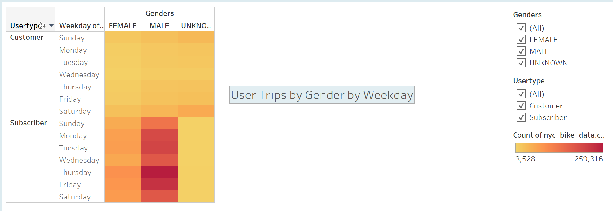
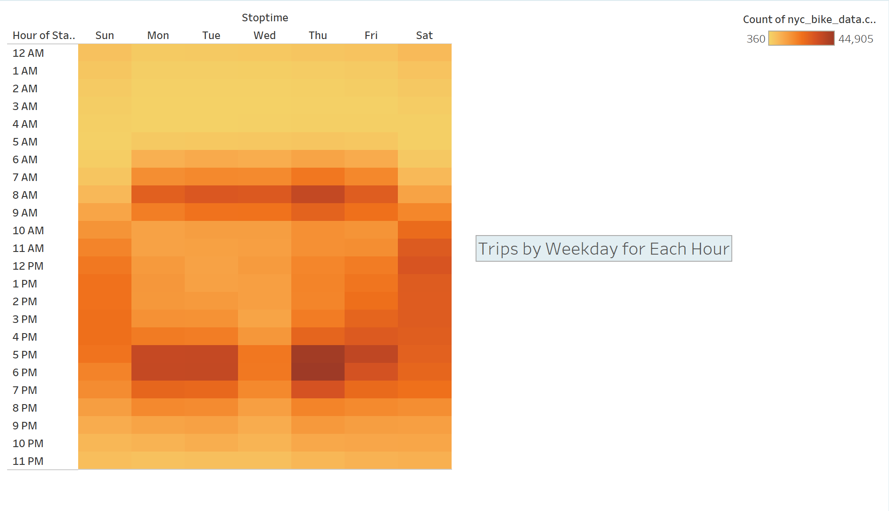
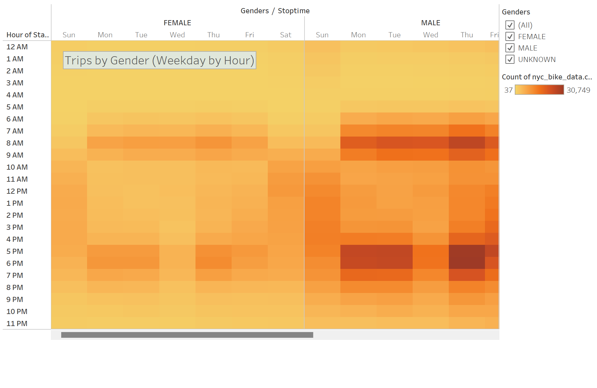
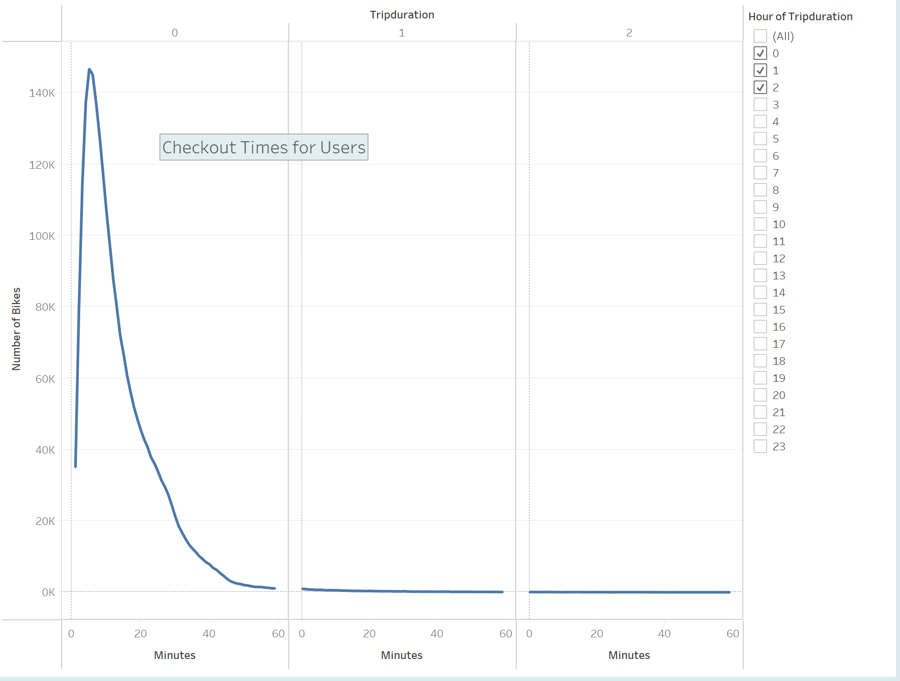
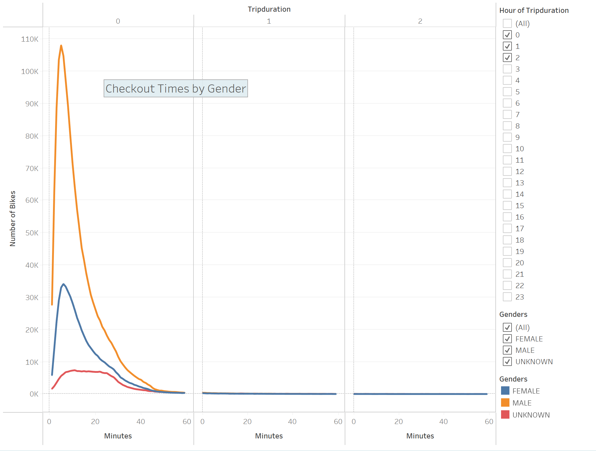
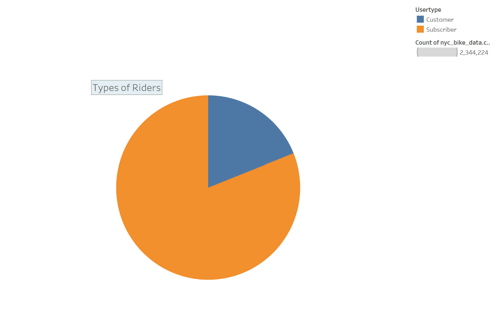

# Module 15: NY Citibike with Tableau

## Project Overview

This project is an effort to convince investors that a bikeshare program, like that in New York City, could thrive in Iowa's capital city, Des Moines. This project includes a bike trip analysis at the request of one of our potential investors. The project was almost entirely created in the Tableau visualization platform, with some data manipulation performed with the Python Pandas library.

## Results

Our first chart depicts the total number of user trips symbolized by gender and by day of the week. The chart cleary shows that male subscribers comprise the majority of total rides. We shouldn't read too far into this, but it does appear that at least in New York City's case, men are more likely to use the bikeshare system and as a result are more likely to pay for a subscription to the service. There is an opportunity here to reach out to women through a marketing campaign to encourage more of them to use bicycles to commute, run errands, and for purely leisurely activity.

Our second chart depicts total trips by weekday for each hour of the day. This chart clearly shows that cycling is far more popular during traditional weekday "rush hours" when most people are traveling to and from work. Use of the NYC Citibike system is concentrated during the hours of 6:00 a.m. and 10:00 a.m. and again between 5:00 p.m. and 9:00 p.m. There is more consistent use throughout the day on Friday as people begin to engage in weekend activities. Ridership is fairly consistent on Saturday and Sunday between 9:00 a.m. and 8:00 p.m.

Our third chart depicts total trips broken out by gender, weekday, and hour. Again, use is highest among men on weekdays during traditional commuting hours. Usage by women is similar in terms of day and time. Please refer to the full story on Tableau Public (linked below) to see more of this chart.

Our fourth chart depicts checkout times for all users; that is, how long are bikes typically checked out in the NYC Citibike system? The chart clearly shows that most rides last approximately 5 minutes. After that there is a precipitous drop-off as time increases up to one hour and beyond. This indicates that bikes in the NYC system are mostly used for short trips around the city as opposed to longer journeys. This makes sense in a dense urban area like New York City. Whether this would also be the case in a less dense city like Des Moines remains to be seen.

Our fifth chart depicts checkout times for all users broken out by gender. As before, it is clear that men are the primary users of the system. Men and women both tend to use bikes for short, quick trips of about 5 to 6 minutes.

Our sixth chart depicts types of riders; that is, subscribers versus one-time casual users (called "customers" in the NYC Citibike data). It is clear that subscribers make up the vast majority of users of the system. This could bode well for a bikeshare system in Des Moines, as a larger number of subscribers are needed for consistent income.

Our seventh and final chart depicts bike utilization. Larger bubbles in the chart depict individual bikes that are used more often or for longer trips. Further analysis could reveal where these particular bikes are checked out and checked back in; are they in more residential or commercial areas? Discovering this information would help determine where to deploy more maintenance infrastructure and crews.

## Summary

The overall message of our analysis of the NYC Citibike system is as follows:

- Most usage occurs on weekdays during traditional commuting "rush hours".

- Most users are male and subscribers.

- Most rides are short and quick, around 5 minutes duration.

- Most bikes show similar levels of utiilization, though some are used more than others.

Two additional visualizations we would like to produce with the current dataset:

- A chart breaking down users by age group.

- A map depicting the most popular start and end stations in the city.